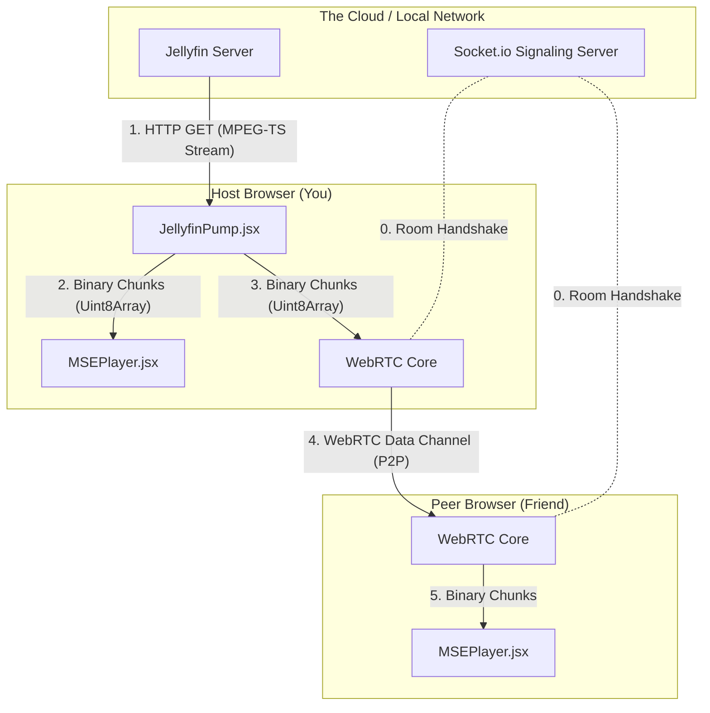

# SameRow-V2: Architecture & Data Pipeline

**SameRow** is a real-time collaborative platform that combines **peer-to-peer video calling** with **synchronized media playback**. It allows users to watch YouTube videos together in perfect sync while seeing and talking to each other in a virtual room.

This project is designed to demonstrate advanced concepts in **distributed systems**, **networking**, and **real-time state management**.

### 🏗️ Architecture
SameRow uses a hybrid architecture to ensure low latency for video calls and precise state synchronization for media playback.
* **Video/Audio:** Uses **WebRTC** for a direct, peer-to-peer connection between clients.
* **Signaling & State:** Uses a central **Node.js/Socket.io** server to manage room state (video timestamps, play/pause status) and broker the WebRTC handshake.

### ✨ Key Features
* **Room-Based Video Calling:** Users can join rooms via a simple ID, instantly connecting with others.
* **Synchronized Media:**
    * Embeds YouTube links directly in the room.
    * Play, pause, and seek actions are broadcast in real-time to all users in the room.
    * Automatic drift correction ensures all clients are within milliseconds of the server's authoritative timestamp.
* **Peer-to-Peer (P2P) Video:** Video and audio streams go directly between users, reducing server load and latency.
* **Smart State Management:** The server maintains a deterministic state, allowing new users to join and instantly sync to the current point in the video.

### 🛠️ Tech Stack
| Component | Technology | Purpose | Deployment |
| :--- | :--- | :--- | :--- |
| **Frontend** | React, Vite | UI, Video Rendering, Media Player | Vercel |
| **Backend** | Node.js, Express | Signaling Server, API | Render |
| **Real-Time** | Socket.io | Signaling, State Synchronization | - |
| **Video/Audio** | WebRTC (simple-peer) | P2P Media Streaming | - |
| **Media Player** | react-player | Unified player for YouTube, etc. | - |

---

## 1. The High-Level Data Pipeline

This section outlines the exact journey a single pixel of video takes—from resting on your Jellyfin server's hard drive to rendering on your friend's monitor across the country.



---

## 2. Step-by-Step Data Journey

### Step 1: The Fetch (Jellyfin -> Host)
* **Component:** `JellyfinPump.jsx`
* **Action:** The Host browser makes a standard `fetch()` request to the Jellyfin server's `/Videos/{id}/stream.ts` endpoint. 
* **The Magic:** Instead of waiting for the entire 2GB movie to download, the Host uses the `ReadableStream` API (`response.body.getReader()`). This allows the browser to intercept raw binary chunks (arrays of bytes) the *millisecond* they arrive over the network.

### Step 2: The Split (Host Internal)
* **Component:** `Room.jsx`
* **Action:** Every time `JellyfinPump` reads a chunk, it passes it to `Room.jsx`. The room acts as a splitter cable.
* **Path A (Local):** It sends the chunk to the Host's own `<MSEPlayer>` so the Host can watch the video.
* **Path B (Remote):** It iterates through every connected friend in the room and shoves the exact same binary chunk into their respective WebRTC connections.

### Step 3: The Transit (Host -> Peer)
* **Component:** WebRTC `simple-peer`
* **Action:** The chunk travels across the internet from the Host's house to the Peer's house. 
* **The Magic:** This bypasses central servers entirely. It uses a **Data Channel**, which is a low-latency pipeline designed for arbitrary binary data (like game state or, in our case, raw video bytes).

### Step 4: The Queue (Peer Internal)
* **Component:** `MSEPlayer.jsx`
* **Action:** The Peer receives the chunks at unpredictable intervals (due to network jitter). If we fed them to the video player instantly, the video would stutter on every microscopic network drop. Instead, we push the chunks into an array (a memory queue). A background loop (`processQueue`) carefully manages this queue, acting as a shock absorber.

### Step 5: The Render (Peer Video Player)
* **Component:** Media Source Extensions API
* **Action:** The `processQueue` loop takes chunks and feeds them into a `SourceBuffer`. The browser's internal engine parses the MPEG-TS headers, extracts the audio and video frames, reads their timestamps, sends them to the computer's hardware decoder (GPU), and paints them to the `<video>` tag.

---

## 3. Key Concepts Defined

> [!NOTE]
> Understanding these foundational web technologies is key to understanding why SameRow works.

### A. WebRTC (Web Real-Time Communication)
WebRTC is a browser API that allows direct Peer-to-Peer (P2P) connections. 
* **Standard use:** Sending live camera and microphone feeds.
* **Our use:** While we use it for cameras, we heavily abuse the **WebRTC Data Channel**, a sub-feature that allows you to send arbitrary binary data (like zip files, chat messages, or raw video streams) directly to another computer without a server in the middle.

### B. Signaling Server (Socket.io)
WebRTC is peer-to-peer, but computers need to know *how* to find each other on the internet first (IP addresses, firewall ports). 
* **Definition:** The Signaling Server is the "matchmaker." 
* **Action:** Your browser tells the Socket.io server, "I want to talk to Bob, here is my IP address." The server relays that message to Bob. Once Bob and you have exchanged IPs and cryptographic keys via the server, the WebRTC connection is forged, and you never need the server again for that video data.

### C. MSE (Media Source Extensions)
Historically, the HTML5 `<video src="movie.mp4">` tag required a standard URL. You couldn't just give it raw bytes from memory.
* **Definition:** MSE is an advanced browser API that lets JavaScript generate media streams on the fly.
* **Action:** You create a blank `MediaSource` object, attach it to the `<video>`, and then use JavaScript to manually append raw binary video chunks (`appendBuffer()`). This is the exact same API that Netflix, YouTube, and Twitch use to build their custom web players.

### D. MPEG-TS (Transport Stream)
Video data needs to be packaged so the player knows what it's looking at. MP4 is terrible for live streaming because the "index" of the file is at the very end.
* **Definition:** MPEG-TS is a container format designed in the 1990s for digital television broadcasting.
* **Action:** It breaks the video into tiny, self-contained packets. Every packet contains its own timestamps (PTS - Presentation Time Stamp). Because every chunk is self-contained, our `MSEPlayer` can start feeding chunks into the browser from the middle of a movie, and the browser instantly knows how to decode it without needing the beginning of the file.

### E. Mesh Network Topology
* **Definition:** An architecture where nodes (users) connect directly to each other.
* **Action:** In SameRow, if there are 3 people (Host + 2 Peers), the Host maintains 2 separate WebRTC connections and uploads the video twice. This is a **Star Mesh** (everyone connects to the Host). This contrasts with a centralized SFU architecture (everyone connects to a cloud server like AWS).

---

## ⚙️ Local Development Setup

Follow these steps to run the project locally.

### Prerequisites
* Node.js (v16+)
* npm or yarn

### 1. Clone the Repository
```bash
git clone https://github.com/your-username/Samerow-V2.git
cd Samerow-V2
```

### 2. Setup the Server
```bash
cd server
npm install
node index.js
```
The server should now be running at `http://localhost:3000`.

### 3. Setup the Client
Open a new terminal window from the project root.
```bash
cd client
npm install
```

Start the client development server.
```bash
npm run dev
```
The client should now be running at `http://localhost:5173`.

### 4. Testing
* Open `http://localhost:5173` in two separate browser tabs.
* Enter the same room name (e.g., "test") in both tabs and join.
* Paste a YouTube link in one tab and test the play/pause synchronization.

---

## 🔮 Future Roadmap
* **Integrate Jellyfin API:** Allow users to securely stream media from their self-hosted Jellyfin servers.
* **Screen Sharing:** Implement a "Screen Share" mode using WebRTC's getDisplayMedia for watching content from non-embeddable sites.
* **User Authentication:** Add user accounts and private, password-protected rooms.
* **Mobile Responsiveness:** Optimize the UI for mobile browsers.

## 📄 License
This project is open-source and available under the MIT License.
